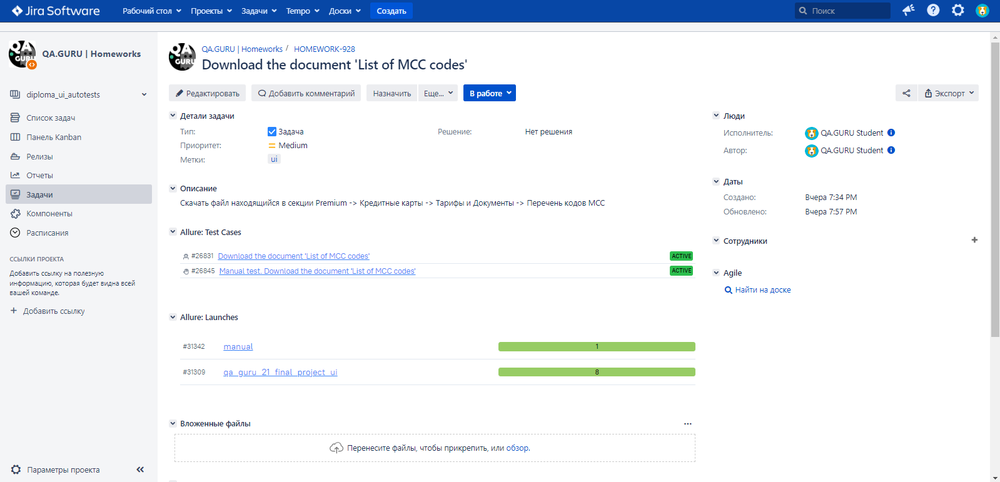

# Проект по автоматизации тестирования UI web-сайта банка Уралсиб

    

> Один из крупнейших универсальных банков федерального уровня, предлагающий финансовые услуги для частных и корпоративных клиентов

## [Содержание](#Содержание)
[Технологии и инструменты](#Технологии-и-инструменты)  
[Удаленный запуск из терминала](#Команда-для-удаленного-запуска-автотестов-из-терминала)  
[Сборка в Jenkins](#Сборка-в-Jenkins)  
[Интеграция с Allure Report](#Интеграция-с-Allure-Report)  
[Интеграция с Allure TestOps](#Интеграция-с-Allure-TestOps)  
[Интеграция с Jira](#Интеграция-с-Jira)  
[Уведомление в Telegram](#Уведомление-в-Telegram)  
[Примеры видео выполнения тестов](#Примеры-видео-выполнения-тестов)

### Технологии и инструменты

Автотесты написаны на языке `Java` с использованием `JUnit 5`, `Selenide`. Запуск браузера осуществляется в `Selenoid`.
Сборщик проекта - `Gradle`. Для удаленного запуска реализована задача в `Jenkins` с формированием `Allure-отчета` и
отправкой результатов в `Telegram канал` при помощи бота. Так же осуществлена интеграция с `Allure TestOps` и `Jira`.

    
    
    
    
    
    
    
    
    
    
    
    

[Назад к содержанию](#Содержание)

### Команда для удаленного запуска автотестов из терминала
`gradle clean test -Denv=remote`

[Назад к содержанию](#Содержание)

### Сборка в [Jenkins](https://jenkins.autotests.cloud/job/qa_guru_21_final_project_ui/)

Для запуска сборки необходимо перейти на страницу проекта [qa_guru_21_final_project_ui](https://jenkins.autotests.cloud/job/qa_guru_21_final_project_ui/)
в `Jenkins`, далее в раздел `Build with Parameters`, выбрать необходимые параметры и нажать
кнопку `Build`.

#### Параметры сборки:
- **WBHOST** - URL Selenoid (по умолчанию - *selenoid.autotests.cloud*)
- **TASK** - задачи (по умолчанию - *test*)
- **BROWSER** - браузер (по умолчанию - *chrome*)
- **BROWSER_VERSION** - версия браузера (по умолчанию - *100.0*)
- **BROWSER_SIZE** - размер окна браузера (по умолчанию - *1920x1080*)

    
    

[Назад к содержанию](#Содержание)

### Интеграция с [Allure Report](https://jenkins.autotests.cloud/job/qa_guru_21_final_project_ui/allure/)
При удаленном запуске тестов в `Jenkins`, автоматически генерируется отчет `Allure Report`.

##### [Overview](https://jenkins.autotests.cloud/job/qa_guru_21_final_project_ui/allure/#)

    

##### [Test details](https://jenkins.autotests.cloud/job/qa_guru_21_final_project_ui/allure/#behaviors/3aba0ed0418c51d9a2541965e677aab4/3b9b3740606ef8e6/)

    

[Назад к содержанию](#Содержание)

### Интеграция с [Allure TestOps](https://allure.autotests.cloud/project/3741/test-cases?treeId=0)

В отчете `Allure TestOps` можно:

- просматривать созданные тест-кейсы и чек-листы,
- запускать ручные и автоматические тестовые прогоны,
- заводить дефекты,
- собирать статистику о проделанной работе.

##### [Allure TestOps Dashboard](https://allure.autotests.cloud/project/3741/dashboards)

    

##### [Ручные и автоматические тест-кейсы](https://allure.autotests.cloud/project/3741/test-cases/26828?treeId=0)

    

[Назад к содержанию](#Содержание)

### Интеграция с [Jira](https://jira.autotests.cloud/browse/HOMEWORK-928)

Интеграция `Allure TestOps` с `Jira`, позволяет отображать в [задаче](https://jira.autotests.cloud/browse/HOMEWORK-928), открытой в `Jira`, какие тест-кейсы были написаны в
рамках задачи и результат их выполнения.

    

[Назад к содержанию](#Содержание)

### Уведомление в [Telegram](https://t.me/uitests)

После завершения сборки, автоматически отправляется отчет о результатах выполнения тестов в специально созданный `Telegram канал`.

    

[Назад к содержанию](#Содержание)

### Примеры видео выполнения тестов

В отчетах Allure для каждого теста создается не только скриншот, но и видео его прохождения.

    

[Назад к содержанию](#Содержание)